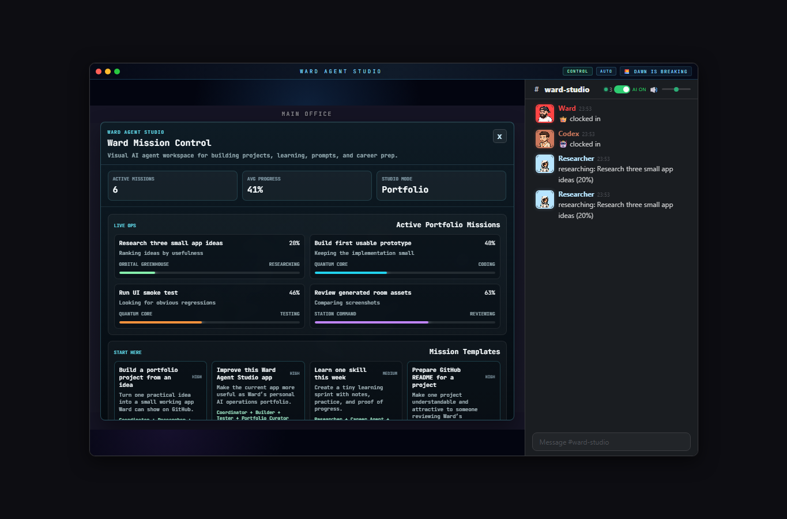
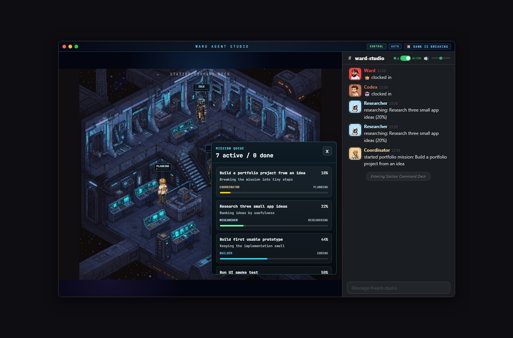
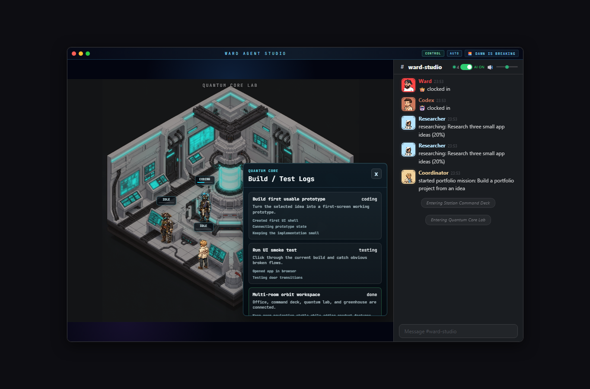
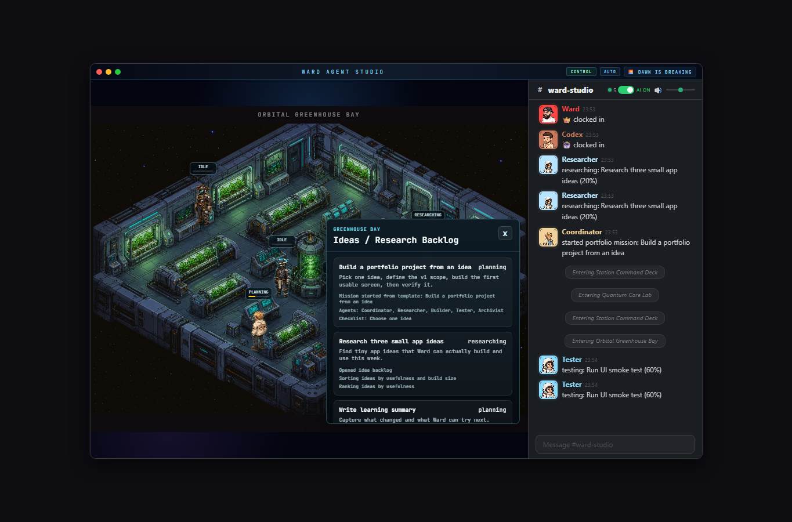

# Ward Agent Studio

Ward Agent Studio is a visual AI agent command center for building portfolio projects, organizing ideas, tracking learning, saving prompts, and preparing career materials.

It started from the Claude-Office concept and is being shaped into a portfolio-ready personal workspace for Ward: an isometric multi-room app where AI agents have visible roles, missions, progress, room-based behavior, and clickable status panels.

## What It Does

- Shows a multi-room isometric agent workspace.
- Keeps the Main Office as the starting room.
- Adds connected space-station rooms:
  - Station Command Deck
  - Quantum Core Lab
  - Orbital Greenhouse Bay
- Provides Ward Mission Control, a compact portfolio dashboard.
- Tracks active missions, project ideas, learning notes, prompt templates, job prep, and build activity.
- Lets the user start demo portfolio missions from templates.
- Shows agent status, progress, current task, last action, elapsed time, and output notes.
- Keeps the current implementation local-first with simulated agent work, ready for real automation later.

## Product Idea

Ward Agent Studio is meant to answer a practical problem:

> "I am not working right now, but I want my AI agents to help me build a portfolio, learn consistently, organize prompts, and prepare for job opportunities."

Instead of a plain todo app, the project turns that workflow into a visual command center. Rooms have purpose:

- Main Office: planning, daily next steps, job/career notes
- Station Command Deck: mission queue, portfolio strategy, coordination
- Quantum Core Lab: building, testing, debugging
- Orbital Greenhouse Bay: ideas, learning, research incubation

## Agent Roles

- Coordinator: chooses priorities and breaks goals into small missions.
- Researcher: studies references, docs, job targets, and project ideas.
- Builder: implements app/project features.
- Tester: runs build checks, UI flows, and screenshots.
- Archivist: writes README notes, changelogs, and learning summaries.
- Career Agent: tracks CV notes, interview prep, and application next steps.
- Portfolio Curator: turns projects into GitHub-ready showcase material.

## Ward Mission Control

The dashboard includes:

- Active Portfolio Missions
- Mission Templates
- Project Ideas
- Learning Roadmap
- Prompt Library
- Job Hunt Tracker
- Build Log / Agent Activity
- Today's Next Steps

Mission templates include:

- Build a portfolio project from an idea
- Improve this Ward Agent Studio app
- Learn one skill this week
- Prepare GitHub README for a project
- Create job application pack
- Research 5 project ideas
- Polish screenshots and demo flow
- Write a project case study

## Screenshots

### Main Office With Ward Mission Control



### Station Command Deck Mission Queue



### Quantum Core Lab Build Logs



### Orbital Greenhouse Ideas And Learning



## Tech Stack

- React
- TypeScript
- Vite
- Express
- WebSocket
- CSS
- Pixel-art PNG assets

## Run Locally

Install dependencies:

```bash
npm install
```

Start the app and local server:

```bash
npm run dev
```

Open:

```text
http://127.0.0.1:3333/
```

Build:

```bash
npm run build
```

## Current Status

The app currently uses local demo mission data and simulated progress updates. Agents move between safe room waypoints and show useful work status, but they do not yet perform real file edits or backend jobs by themselves.

## Roadmap

- Save mission/project data locally.
- Connect Start Mission to real workspace tasks.
- Let agents write structured markdown logs.
- Add GitHub-ready screenshot export flow.
- Add real build/test command execution logs.
- Add job application tracking persistence.
- Prepare a clean public GitHub repo as `ward-agent-studio`.

## Portfolio Notes

This project is designed to be shown as a portfolio piece because it combines:

- frontend product design
- stateful React UI
- multi-room interaction
- game-like visual systems
- AI workflow planning
- practical career/portfolio tooling

The important next step before pushing publicly is to review assets, confirm attribution requirements from the original Claude-Office project, and publish under Ward's own GitHub repository instead of the upstream clone remote.
